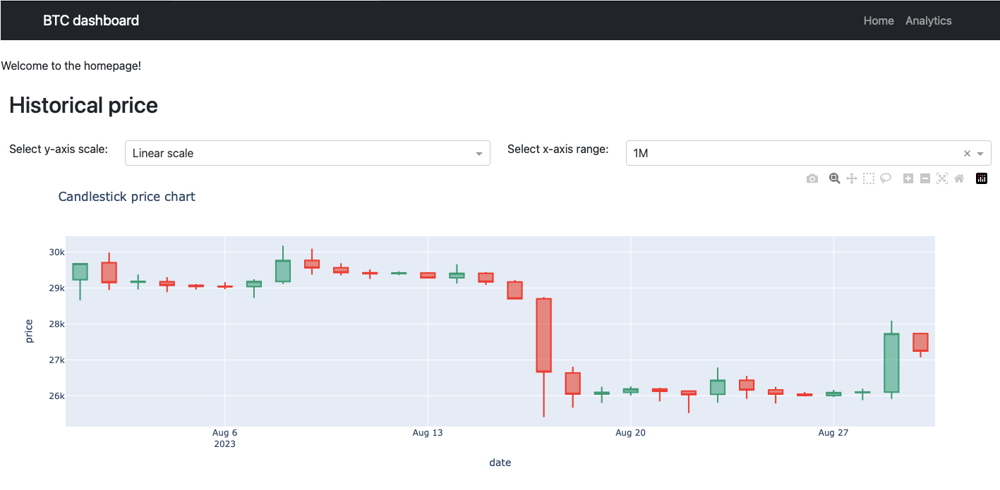

# BTCdashboard

## About this app

I want to create a dashboard for tracking Bitcoin price, implementing a few Stochastic Calculus analyses, and building a toy Put/Call option, based on Black&Scholes European option pricing.

## Requirements

* Python 3

## How to run this app

I suggest to create a virtual environment for running this app with Python 3. Clone this repository 
and open a terminal/command prompt in the root folder.

```
git clone https://github.com/FrancescoMalaspina/BTCdashboard
python3 -m virtualenv .venv
```
In Unix system:
```
source venv/bin/activate
```
In Windows:
```
venv\Scripts\activate
```

Install all required packages by running:
```
pip install -r requirements.txt
```

Run this app locally with:
```
cd DashApp
python app.py
```

## Screenshot



## Resources

* [Dash](https://dash.plot.ly/)
* [Dash bootstrap components](https://dash-bootstrap-components.opensource.faculty.ai)
## Licence
