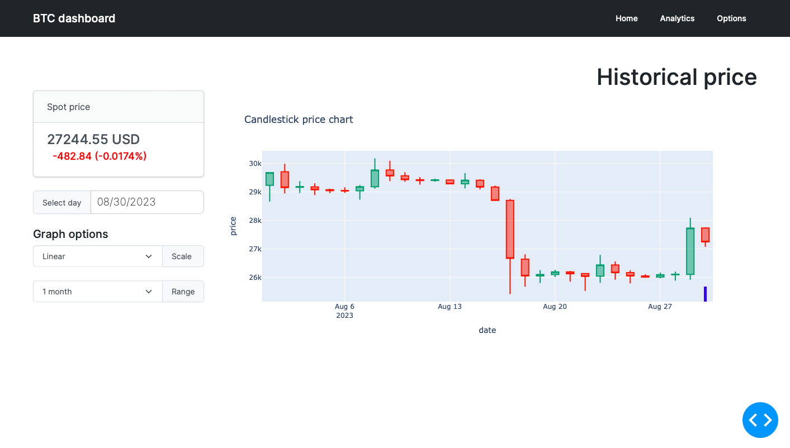
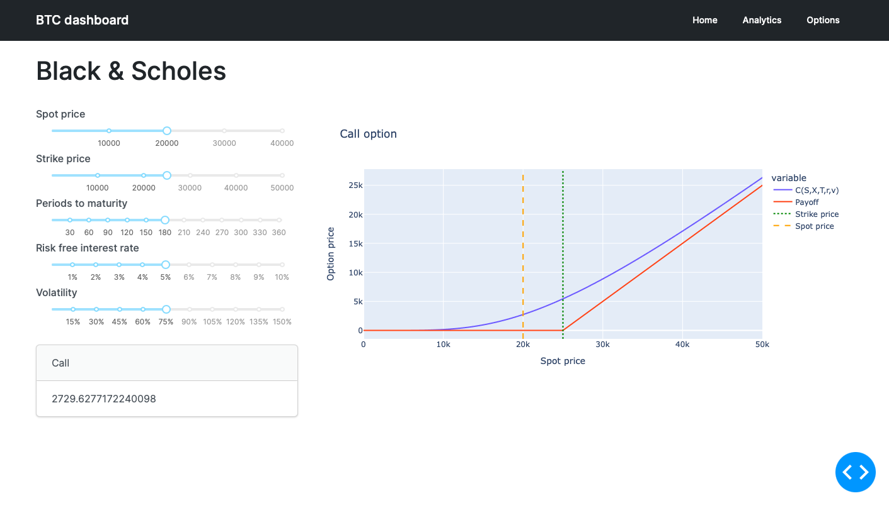

# BTCdashboard

## About this app

This app implements a dashboard, using the Plolty Dash Framework, for Bitcoin price analysis.

It implements 3 different pages:
- the Homepage presents a price Card and CandleStick price chart;
- the Analitcs page details an analysis of historical prices, through the lens of Econophysics and Stochastic Calculus;
- the Options page contains a toy Put/Call option, based on Black&Scholes European option pricing (TODO: implement MonteCarlo and Binomial Tree option pricing).

The app is deployed in `pythonanywhere` at link [http://photonicaardvark.eu.pythonanywhere.com/](http://photonicaardvark.eu.pythonanywhere.com/).

## Requirements

* Python 3
* dash>=2.5
* dash-bootstrap-components
* dash-latex
* pandas
* plotly

## How to run this app

I suggest to create a virtual environment for running this app with Python 3. Clone this repository 
and open a terminal/command prompt in the root folder.

```
git clone https://github.com/FrancescoMalaspina/BTCdashboard
python3 -m virtualenv .venv
```
In Unix system:
```
source venv/bin/activate
```
In Windows:
```
venv\Scripts\activate
```

Install all required packages by running:
```
pip install -r requirements.txt
```

Run this app locally with:
```
python3 app.py
```

## Screenshot




## Resources

* [Dash](https://dash.plot.ly/)
* [Dash bootstrap components](https://dash-bootstrap-components.opensource.faculty.ai)
* [Yahoo finance BTC-USD](https://finance.yahoo.com/quote/BTC-USD/history?p=BTC-USD)
## Licence
This project is licensed under the terms of the MIT license.
